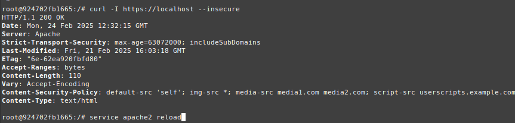
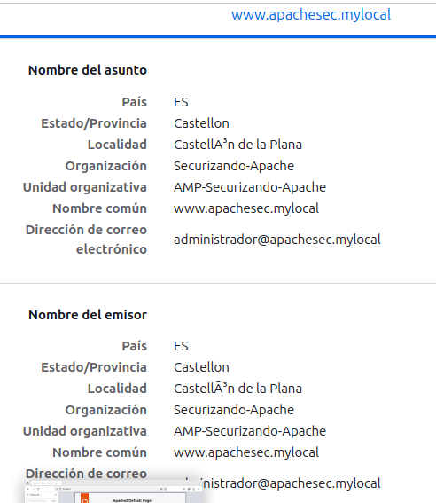
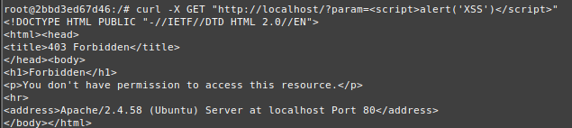
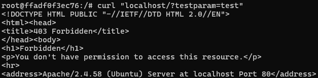
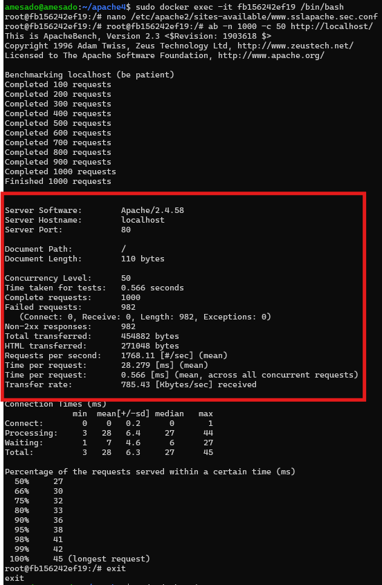

# 3.1.1. Práctica 1 : CSP

Este proyecto proporciona un contenedor Docker basado en Ubuntu con Apache configurado de manera segura, incluyendo medidas de seguridad como la desactivación del módulo autoindex, configuración de cabeceras HTTP seguras y certificados SSL.

## Características de la práctica 1

- **Deshabilitación del módulo autoindex para evitar la exposición no deseada de archivos y directorios.
- **Habilitación de HSTS (HTTP Strict Transport Security)** para forzar el uso de HTTPS.
- **Configuración de Content Security Policy (CSP)** para mitigar ataques XSS.
- **Uso de certificados SSL** para asegurar la comunicación HTTPS.
- **Exposición de los puertos 80 y 443** para tráfico HTTP y HTTPS.

### [Configuración del Dockerfile](https://github.com/alvaromespen/pps-10003375/blob/main/template-main/RA3/RA3_1/RA3_1_1/Assets/Apache-CSP/Dockerfile)

## Capturas de Pantalla

Aquí puedes ver ejemplos de las configuraciones aplicadas y sus efectos en el servidor Apache:

1. **Apache en ejecución:**

   

2. **Cabeceras HTTP configuradas correctamente:**

   

3. **Sitio web con Apache seguro cargado en el navegador:**
    
   

## Seguridad en Apache

### Deshabilitar `mod_autoindex`

El módulo `autoindex` se deshabilita para evitar que los directorios sin un `index.html` o `index.php` muestren su contenido públicamente.

```bash
RUN a2dismod -f autoindex
```

### Configurar HSTS

La cabecera `Strict-Transport-Security` se configura para reforzar el uso de HTTPS.

```apache
<VirtualHost *:443>
  Header always set Strict-Transport-Security "max-age=63072000; includeSubDomains"
</VirtualHost>
```

### Configurar Content Security Policy (CSP)

Se define una política CSP para restringir la carga de contenido desde orígenes específicos.

```apache
Header set Content-Security-Policy \ 
  "default-src 'self'; img-src *; media-src media1.com media2.com; script-src userscripts.example.com"
```

# 3.1.1. Práctica 2 : Web Application Firewall

Este práctica implementa un **Web Application Firewall (WAF)** utilizando **ModSecurity** en un servidor Apache dentro de un contenedor Docker. Se encarga de filtrar y bloquear tráfico malicioso en aplicaciones web.

## Características del Proyecto

- **Implementación de ModSecurity** como WAF para protección contra ataques web.
- **Bloqueo de inyecciones SQL, XSS y CSRF**.
- **Uso de reglas básicas de seguridad del OWASP ModSecurity Core Rule Set (CRS)**.
- **Configuración de Apache con seguridad mejorada**.
- **Pruebas de funcionalidad con intentos de XSS bloqueados**.

### [Configuración del Dockerfile](https://github.com/alvaromespen/pps-10003375/blob/main/template-main/RA3/RA3_1/RA3_1_1/Assets/Web%20Application%20Firewall/Dockerfile)

## Capturas de Pantalla

Aquí puedes ver ejemplos de la configuración y pruebas de ModSecurity en acción:

1. **Intento de ataque XSS bloqueado:**
   
   

La respuesta debería ser un código **403 Forbidden**, indicando que el ataque ha sido bloqueado.

## Conclusión

Este proyecto proporciona un entorno seguro para aplicaciones web mediante la implementación de un **WAF con ModSecurity** en Apache. Bloquea ataques comunes como **XSS, SQL Injection y CSRF**, protegiendo la infraestructura web sin modificar la aplicación en sí.

# 3.1.1. Práctica 3 : OWASP

## Descripción
En esta práctica, instalaremos Apache con las reglas OWASP para mod_security y comprobaremos su funcionamiento. Posteriormente, crearemos una imagen de Docker que automatice la instalación y configuración de estas reglas.

## Instalación de las Reglas OWASP
OWASP proporciona una configuración por defecto que incluye protección contra las amenazas más comunes. La mejor estrategia es comenzar con este conjunto de reglas y luego personalizarlo según las necesidades del servidor.

### [Configuración del Dockerfile](https://github.com/alvaromespen/pps-10003375/blob/main/template-main/RA3/RA3_1/RA3_1_1/Assets/OWASP/Dockerfile)
En este caso el DockerFile no incluye configuraciones, ya que en un principio construí la imagen usando la imagen de la práctica 2, no obtante, tras realizar muchas configuraciones debido a errores con la implementación de OWASP, y al final conseguir que funcionara a la perfección, no supe solucionar el Dockerfile para generar un Dockerfile bien escrito, por lo que hice un commit de es contenedor y subí la imagen.

### Pasos para la instalación
1. **Instalar mod_security2**
   ```bash
   sudo apt update
   sudo apt install libapache2-mod-security2 -y
   ```

2. **Clonar el repositorio de OWASP ModSecurity CRS**
   ```bash
   git clone https://github.com/SpiderLabs/owasp-modsecurity-crs.git
   ```

3. **Mover el archivo de configuración a la ruta correcta**
   ```bash
   cd owasp-modsecurity-crs
   sudo mv crs-setup.conf.example /etc/modsecurity/crs-setup.conf
   ```

4. **Mover las reglas al directorio de configuración de mod_security**
   ```bash
   sudo mv rules/ /etc/modsecurity
   ```
   Si aparece algún error, ejecuta:
   ```bash
   sudo mkdir /etc/modsecurity/rules
   cd rules
   sudo cp *.* /etc/modsecurity/rules
   ```

5. **Verificar que las reglas estén cargadas en `security2.conf`**
   ```bash
   sudo nano /etc/apache2/mods-enabled/security2.conf
   ```
   Asegúrate de que el contenido incluye:
   ```apache
   <IfModule security2_module>
       SecDataDir /var/cache/modsecurity
       SecRuleEngine On
       IncludeOptional /etc/modsecurity/*.conf
       Include /etc/modsecurity/rules/*.conf
   </IfModule>
   ```

6. **Configurar una regla personalizada**
   Edita el archivo de configuración del host virtual:
   ```bash
   sudo nano /etc/apache2/sites-available/000-default.conf
   ```
   Añade la siguiente regla:
   ```apache
   SecRuleEngine On
   SecRule ARGS:testparam "@contains test" "id:1234,deny,status:403,msg:'Cazado por Ciberseguridad'"
   ```

7. **Reiniciar Apache**
   ```bash
   sudo systemctl restart apache2
   ```

## Pruebas de funcionamiento

Ejecuta el siguiente comando para verificar que la regla bloquea la petición:



Si la configuración es correcta, recibirás la respuesta HTTP 403 Forbidden:

# 3.1.4. Práctica 4 : Evitar ataques DDOS

## Descripción
En esta práctica instalaremos Apache con el módulo `mod_evasive`, el cual ayuda a mitigar ataques de denegación de servicio (DoS). Además, crearemos una imagen Docker que automatice la instalación y configuración del módulo. Toda esta configuración está en el Dockerfile.

### [Configuración del Dockerfile](https://github.com/alvaromespen/pps-10003375/blob/main/template-main/RA3/RA3_1/RA3_1_1/Assets/Evitar_ataques_DDOS/Dockerfile)
### [Fichero evasive.conf](https://github.com/alvaromespen/pps-10003375/blob/main/template-main/RA3/RA3_1/RA3_1_1/Assets/Evitar_ataques_DDOS/evasive.conf)

Para realizar las pruebas vamos a ejecutar el siguiente comando, el cuál sto simulará 1000 solicitudes concurrentes con 50 conexiones simultáneas. Si el módulo está funcionando correctamente, debería empezar a rechazar peticiones y mostrar errores 403 en el informe.



Como podemos observar solo ha acpetado las 18 primeras peticiones y ha rechazado todas las demás.
