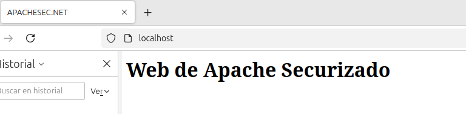

# 3.1.1. Práctica 1 : CSP

Este proyecto proporciona un contenedor Docker basado en Ubuntu con Apache configurado de manera segura, incluyendo medidas de seguridad como la desactivación del módulo autoindex, configuración de cabeceras HTTP seguras y certificados SSL.

## Características de la práctica 1

- **Deshabilitación del módulo autoindex para evitar la exposición no deseada de archivos y directorios.
- **Habilitación de HSTS (HTTP Strict Transport Security)** para forzar el uso de HTTPS.
- **Configuración de Content Security Policy (CSP)** para mitigar ataques XSS.
- **Uso de certificados SSL** para asegurar la comunicación HTTPS.
- **Exposición de los puertos 80 y 443** para tráfico HTTP y HTTPS.

## [Configuración del Dockerfile](https://github.com/alvaromespen/pps-10003375/blob/main/template-main/RA3/RA3_1/RA3_1_1/Assets/Apache-CSP/Dockerfile)

## Capturas de Pantalla

Aquí puedes ver ejemplos de las configuraciones aplicadas y sus efectos en el servidor Apache:

1. **Apache en ejecución:**
   

2. **Cabeceras HTTP configuradas correctamente:**
   

3. **Prueba de seguridad XSS bloqueada:**
   

4. **Prueba de acceso bloqueado:**
   

5. **Prueba de carga con Apache Benchmark:**
   

6. **Sitio web con Apache seguro cargado en el navegador:**
   

## Seguridad en Apache

### Deshabilitar `mod_autoindex`

El módulo `autoindex` se deshabilita para evitar que los directorios sin un `index.html` o `index.php` muestren su contenido públicamente.

```bash
RUN a2dismod -f autoindex
```

### Configurar HSTS

La cabecera `Strict-Transport-Security` se configura para reforzar el uso de HTTPS.

```apache
<VirtualHost *:443>
  Header always set Strict-Transport-Security "max-age=63072000; includeSubDomains"
</VirtualHost>
```

### Configurar Content Security Policy (CSP)

Se define una política CSP para restringir la carga de contenido desde orígenes específicos.

```apache
Header set Content-Security-Policy \ 
  "default-src 'self'; img-src *; media-src media1.com media2.com; script-src userscripts.example.com"
```

## Cómo Usarlo

1. **Construir la imagen Docker:**

   ```bash
   docker build -t apache-secure .
   ```

2. **Ejecutar el contenedor:**

   ```bash
   docker run -p 80:80 -p 443:443 -d apache-secure
   ```

3. **Verificar que el servidor está funcionando:**

   ```bash
   curl -I https://localhost --insecure
   ```

## Conclusión

Este proyecto proporciona una configuración segura para servidores Apache en contenedores Docker. Implementa buenas prácticas de seguridad, como la protección contra XSS y la restricción de contenido externo mediante CSP. También mejora la seguridad con HSTS y evita la exposición de directorios mediante la desactivación de `autoindex`.


