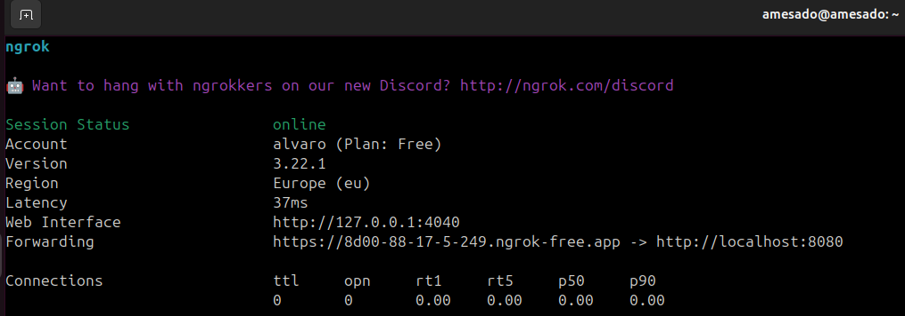
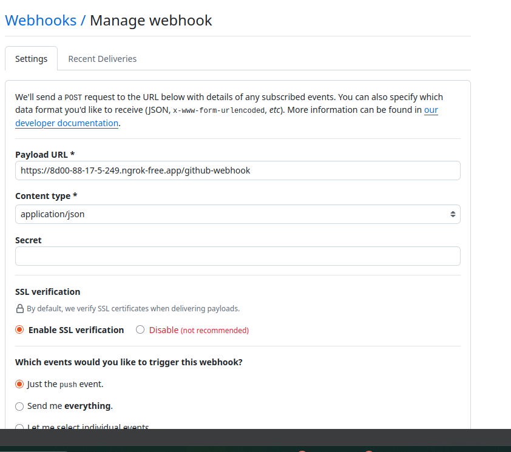
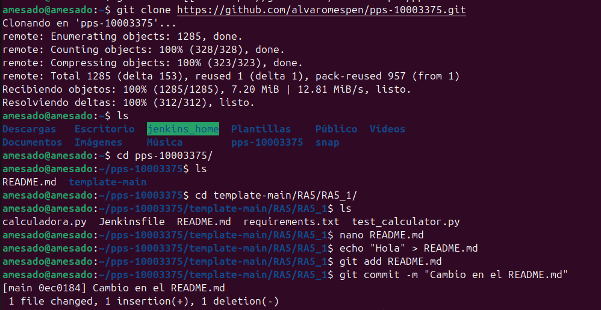
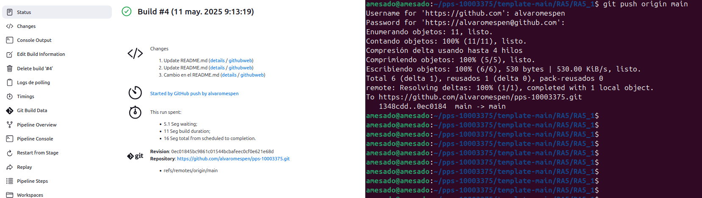
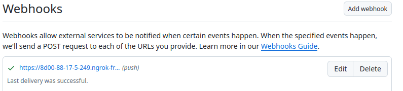

# Jenkins

**Introducción**

A lo largo de esta práctica nos proponemos diseñar y poner en marcha una pipeline de integración continua utilizando Jenkins, Docker y Docker Compose. Nuestro objetivo principal es automatizar el ciclo de vida de una aplicación, desde la construcción de su imagen hasta la ejecución de pruebas, todo ello dentro de un entorno controlado y reproducible mediante contenedores. No obstante, primero lo realizaremos de manera básica y posteriormente ya haremos uso de jenkinsfile.docker.

A lo largo del proceso, configuraremos Jenkins para clonar un repositorio, construir la imagen Docker de la aplicación, ejecutar los contenedores necesarios y realizar pruebas automatizadas sobre el entorno desplegado. 

# Parte 1 - Tarea 1: Creación de los programas de python:

Para este caso, hemos creado una calculadora que se centre en multiplicar números (calculadora.py) y una serie de pruebas unitarias para realizar pruebas (test_calculator.py), los cuáles son los siguientes:

- [Calculadora.py](https://github.com/alvaromespen/pps-10003375/blob/main/template-main/RA5/RA5_1/calculadora.py)
- [test_calculator.py](https://github.com/alvaromespen/pps-10003375/blob/main/template-main/RA5/RA5_1/test_calculator.py)

Hemos ejecutado una serie de pruebas del funcionamiento de los mismos:

En la primera imagen, vemos que la calculadora realiza la multiplicación sin problema, pero en caso de no pasar un número, el código lanzará la excepción y mostrará el print introducido por pantalla en caso de que el programa devuelva el error introducido, que en este caso es ValueError, y finalmente detendrá la ejecución.

En estas dos siguientes imágenes, vemos como funciona a la perfección las pruebas unitarias, en la primera están todos los valores correctos para que funcione sin problema, y en la seguna imagen hemos modificado un resultado y vemos como nos devuelve error el programa y nos especifica donde es.

# Parte 1 - Tarea 2: Creación de la canalización de la CI con Jenkinsfile:

El objetivo de esta parte es diseñar e implementar una canalización (pipeline) de integración continua para un proyecto en Python mediante Jenkins. Se busca automatizar el proceso de pruebas del código ante cada cambio en el repositorio, validando su correcto funcionamiento y garantizando una mayor fiabilidad en el desarrollo.

Estructura del proyecto:

| Archivo              | Descripción                                                    |
| -------------------- | -------------------------------------------------------------- |
| `calculadora.py`      | Contiene la lógica principal de la calculadora.                |
| `test_calculator.py` | Incluye las pruebas unitarias utilizando el módulo unittest. |
| `Dockerfile`         | Define la imagen del contenedor para ejecutar la aplicación.   |
| `Jenkinsfile`        | Especifica la pipeline declarativa para Jenkins.               |

Si se desea echar un vistazo tanto al Jenkinsfile como al Dockerfile a continuación están unos enlaces directos.

- [Jenkinsfile](https://github.com/alvaromespen/pps-10003375/blob/main/template-main/RA5/RA5_1/Jenkinsfile)
- [Dockerfile](https://github.com/alvaromespen/pps-10003375/blob/main/template-main/RA5/RA5_1/Dockerfile)

Para esta parte de la práctica hemos descargado un docker con Jenkins para acelerar el proceso de instalación, en este docker, hemos tenido que realizar la instalación de python, ya que no iba por defecto, y también hemos tenido que configurar ngrok para utilizarlo en github, ya que este no resuelve direcciones privadas haciendo uso de webhook.

Para proceder con Jenkins tenemos que crear un nuevo proyecto y especificar que sea de tipo Pipeline, y tras eso introduciremos los siguientes datos en el apartado de Repositories:

- Repository URL: https://github.com/alvaromespen/pps-10003375.git
- Branch Specifier: */main
- Script path: template-main/RA5/RA5_1/Jenkinsfile

Tras esto procederemos con la configuración de Github, donde ngrok nos proporciona una URL que hace referencia a nuestro localhost en el puerto 8080 como el de Jenkins:

Por lo que usaremos la URL de Forwarding para configurar el Webhook de github:

Una vez configurado el github y Jenkins, vamos a realizar un git clone de nuestro repositorio, en el cuál vamos a modificar el README.md para que se active la pipeline de forma automática y veamos los resultados en Jenkins.

Como podemos observar se ha lanzado de manera automática y ha detectado también el commit, ya que como se ve en la salida de la última imagen se ve el mensaje que habíamos especificado con el -m.

Y también si accedemos al webhook de github, vemos que nos dice que el último push ha sido exitoso.

# Parte 2: Creación de la canalización de la CI con Jenkinsfile.docker:

En esta parte de la práctica, hemos diseñado una pipeline declarativa en Jenkins utilizando un fichero específico llamado Jenkinsfile.docker. Esta pipeline tiene como objetivo automatizar el ciclo completo de CI del proyecto de calculadora en un entorno Docker.

La estructura del proyecto en esta parte es la siguiente:

| Archivo              | Descripción                                                                   |
| -------------------- | ----------------------------------------------------------------------------- |
| `calculadora.py`      | Contiene la lógica principal de la calculadora.                               |
| `test_calculator.py` | Incluye las pruebas unitarias utilizando el módulo unittest.                |
| `Dockerfile`         | Define la imagen del contenedor para ejecutar la aplicación.                  |
| `docker-compose.yml` | Orquesta los servicios necesarios para la ejecución de la aplicación.         |
| `Jenkinsfile`        | Especifica la pipeline declarativa de integración continua básica.            |
| `Jenkinsfile.docker` | Define la pipeline que se ejecuta en entorno Docker e integra Docker Compose. |
