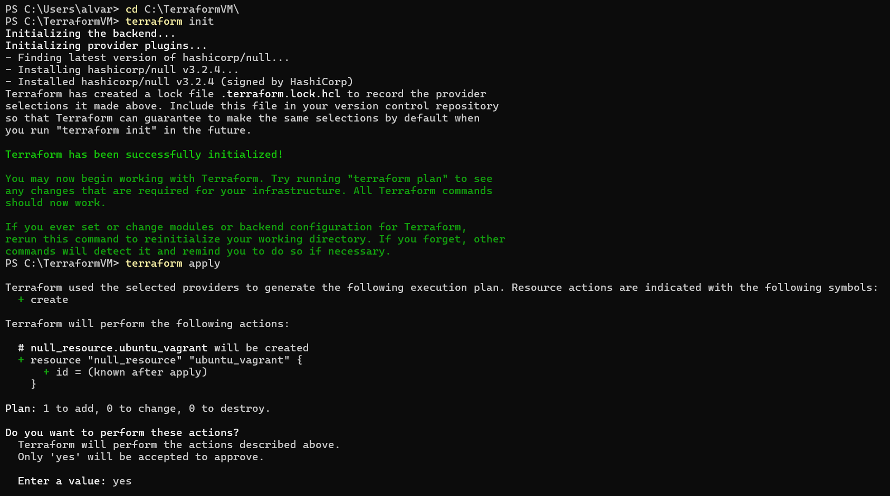
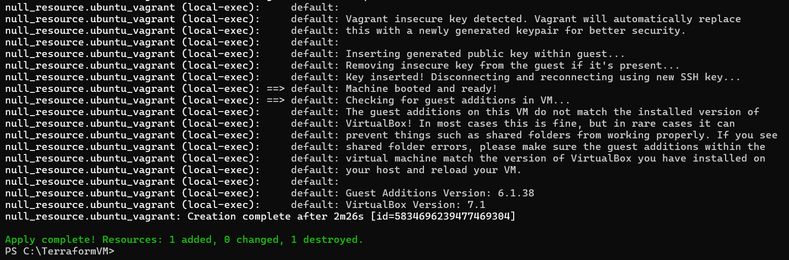
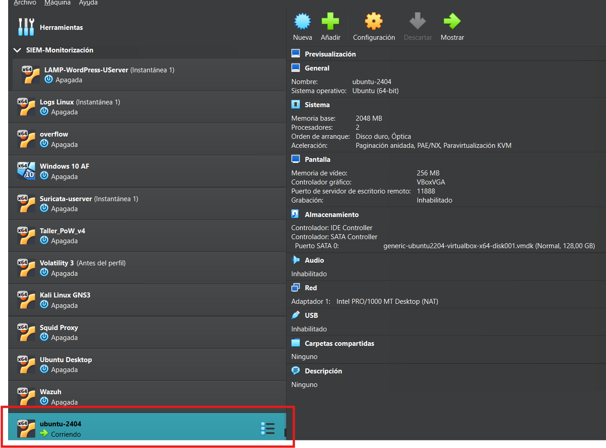
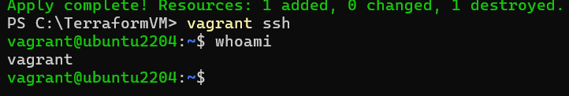

# Introduccion

A lo largo del siguiente documento veremos cómo automatizar la provisión y configuración de una máquina virtual Ubuntu 22.04, en nuestro caso hemos hecho uso de la version 22.04, ya que en ciertas ocasiones la versión 24.04, aún no se encuentra disopnible en ciertos repositorios de imágenes, utilizando herramientas de Infraestructura como Código (IaC), integrando Terraform y Ansible para lograr un entorno reproducible y gestionado de forma eficiente.

Terraform es una herramienta que permite definir y desplegar infraestructura mediante archivos de configuración escritos en HCL (HashiCorp Configuration Language). Su enfoque declarativo y su compatibilidad con múltiples plataformas hacen posible crear entornos complejos de forma automatizada, segura y predecible.

Ansible es una herramienta de automatización de configuración que permite gestionar y configurar sistemas a través de archivos YAML llamados playbooks, sin necesidad de instalar agentes en los nodos. Es ideal para instalar servicios, aplicar parches o desplegar aplicaciones en servidores ya aprovisionados.

No obstante, mientras desarrollábamos esta práctica, recibimos una serie de problemas con Terraform, debido a que el origen de los proveedores no eran oficiales, lo que generaba un sinfin de errores debido a estos, finalmente conseguimos hacer con Terraform que se crearan las VM, pero seguía generando errores, en este caso, eran errores con los adaptadores de red, que al no generarlos como tocaba, simplemente los convertía en datos y no realizaba nada más, tras haber investigado, no hemos podido descubrir como solucionarlo, por lo que hemos tenido que utilizar Vagrant como backend de virtualización, ¿Pero que es Vagrant?

Vagrant es una herramienta que facilita la creación y gestión de entornos de desarrollo virtualizados. Se integra fácilmente con VirtualBox y otras plataformas, permitiendo levantar máquinas virtuales de manera automatizada y sencilla.

# Requisitos 🏗️

- VirtualBox instalado.
- Vagrant instalado
- Instalar Terraform y agregarlo a las variables de entorno del equipo. En windows (Abre el Panel de Control → Sistema → Configuración avanzada del sistema → Variables de entorno → “Path” → Editar → Agregar C:\Terraform.)

# Parte 1: Provisionar una máquina virtual Ubuntu 24.04 en Virtualbox mediante Terraform

En esta parte tenemos que realizar solo la implementación de la VM para que se encuentre funcional y podamos acceder de manera remota con SSH, para ello hemos hecho uso de el fichero main.tf, el cuál lo único que hacer es decir que el aprovisionador se ejecutará de manera local, y lo que hará será llamar a vagrant up para que ejecute el fichero Vagrantfile y de esa manera se automatice la creación de la VM, los ficheros utilizados son los siguientes:

- [main.tf](https://github.com/alvaromespen/pps-10003375/blob/main/template-main/RA5/RA5_2/main.tf)
- [Vagrantfile](https://github.com/alvaromespen/pps-10003375/blob/main/template-main/RA5/RA5_2/Vagrantfile)

En este caso, la configuración del Vagrantfile en este apartado era solo hasta el primer comentario en el fichero, sin incluirlo, ya que lo único que queríamos conseguir es que se automatizara la creación de la VM.

Una vez con ambos ficheros creados, y en su directorio, vamos a inicializar el Terraform, y tras eso, ejecutaremos su contenido con *apply*, de esta manera se ejecutará el vagrant up y se creará la VM como vemos a continuación.





Y como hemos podido observar, se ha creado la VM sin ningún problema, por lo que a continuación si hacemos uso del comando vagrant ssh, accedemos a dicha VM de manera remota.



De esta manera, hemos podido completar esta primera parte, por lo que a continuación, ejecutaremos un `´vagrant destroy -f` lo que detendrá la VM y borrará todos sus datos, así podremos seguir con la siguiente parte, donde además de crear una VM, la actualizaremos y aprovisionaremos con un servidor apache.

# Parte 2: Configurar actualización automática e implementación del servidor apache haciendo uso de Ansible.

En este aparado, lo que haremos será que a través de Ansible, indicaremos que queremos que se actualicen los repositorios y los paquetes, además de que instalaremos el servidor Apache, para ello hacemos uso del fichero de Ansible llamado playbook.yml, y además ahora ya hacemos uso de todo el fichero de Vagrantfile, donde en el primer comentario, lo que hacemos es forzar la sincronización de carpetas compartidas para poder hacer uso del fichero .yml, ya que sino genera un error con los Guest Addition de VirtualBox, y tras eso, añadimos la configuración de que haremos uso del .yml, los ficheros utilizados son los dos mismos que antes, pero ahora con Ansible también.

- [main.tf](https://github.com/alvaromespen/pps-10003375/blob/main/template-main/RA5/RA5_2/main.tf)
- [Vagrantfile](https://github.com/alvaromespen/pps-10003375/blob/main/template-main/RA5/RA5_2/Vagrantfile)
- [playbook.yml](https://github.com/alvaromespen/pps-10003375/blob/main/template-main/RA5/RA5_2/playbook.yml)

En este apartado, el fichero de playbook solo tenía de contenido hasta la instalación de apache, ya que el final del fichero es del útlimo apartado.

Una vez con estos ficheros, podemos ejecutarlo de dos maneras, si queremos volver a ejecutar el terraform con el apply, debido a que este no se ejecutará si no se han realizado modificaciones en su fichero, podemos hacer una de las dos siguientes cosas que hemos planteado:

**Opción 1:**

En esta opción, lo que haremos será añadir un trigger al main.tf, el cuál sirve para forzar que se vuelva a ejecutar en cada terraform apply, aunque no haya ningún otro cambio en la configuración. EL trigger en cuestión es el siguiente:

```hcl
triggers = {
  always_run = "${timestamp()}"
}
```

